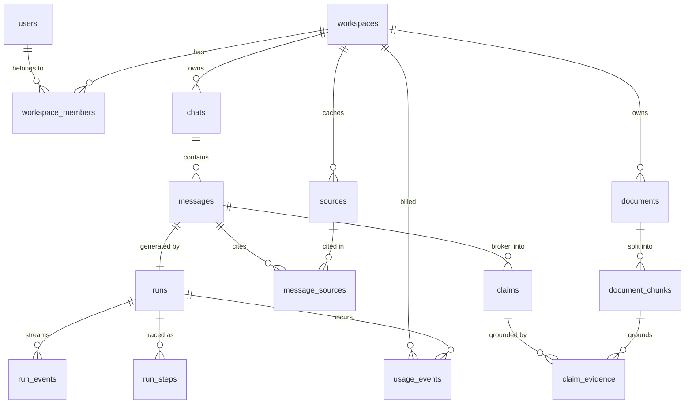

# Anvay AI — Data Model

**Target:** PostgreSQL 16+ with `pgvector` ≥ 0.8
**ORM:** Drizzle
**Status:** design — not yet migrated

---

## 1. Principles

These decide most of what follows, so they're worth stating first.

1. **Tenant scoping is physical, not derived.** Every tenant-owned row carries
   `workspace_id` even where it could be joined for. It costs a column; it buys
   single-predicate authorisation, cheap composite indexes, and a working RLS
   story later.
2. **Money and time are never floats.** Costs are `bigint` micro-USD. Timestamps
   are always `timestamptz` — `timestamp` without zone is a bug waiting for a
   deploy in another region.
3. **The event log is append-only.** `run_events` is never updated or deleted in
   normal operation. It's the durable transcript that makes streaming resumable.
4. **Deletion has two meanings.** User-facing "delete" is `deleted_at` (recoverable,
   keeps foreign keys intact). Privacy deletion is a hard `DELETE` that must take
   embeddings with it.
5. **IDs are UUIDv7, generated in the app.** Time-ordered, so index locality stays
   good as tables grow — unlike v4, which scatters writes across the B-tree.
   Generate in TypeScript so a row's id exists before it's inserted.

---

## 2. Extensions and enums

```sql
CREATE EXTENSION IF NOT EXISTS vector;     -- embeddings
CREATE EXTENSION IF NOT EXISTS pg_trgm;    -- fuzzy title search
CREATE EXTENSION IF NOT EXISTS unaccent;   -- accent-insensitive FTS
CREATE EXTENSION IF NOT EXISTS citext;     -- case-insensitive email

CREATE TYPE workspace_role   AS ENUM ('owner', 'admin', 'member');
CREATE TYPE message_role     AS ENUM ('user', 'assistant', 'system');
CREATE TYPE run_status       AS ENUM ('queued','running','succeeded','failed','cancelled');
CREATE TYPE step_status      AS ENUM ('pending','active','complete','error','skipped');
CREATE TYPE agent_kind       AS ENUM ('gateway','memory','search','code','rag','synthesizer','validator');
CREATE TYPE run_event_type   AS ENUM ('trace','token','source','usage','claim','done','error');
CREATE TYPE document_status  AS ENUM ('uploaded','parsing','chunking','embedding','ready','failed');
CREATE TYPE claim_verdict    AS ENUM ('grounded','partial','ungrounded','unchecked');
CREATE TYPE model_access     AS ENUM ('direct','router','local');
```

> **On enums:** good for genuinely closed sets. Adding a value is
> `ALTER TYPE ... ADD VALUE` (fine, non-blocking); *removing* one is not
> supported. `agent_kind` is the one most likely to grow — that's acceptable,
> since we only ever add agents.

---

## 3. Identity and tenancy

### `users`

Auth.js owns the shape of the next four tables. Don't fight the adapter.

```sql
CREATE TABLE users (
  id             uuid PRIMARY KEY,
  email          citext UNIQUE NOT NULL,
  email_verified timestamptz,
  name           text,
  image          text,
  created_at     timestamptz NOT NULL DEFAULT now(),
  updated_at     timestamptz NOT NULL DEFAULT now(),
  deleted_at     timestamptz
);
```

`citext` means `Rushabh@x.com` and `rushabh@x.com` can't both register — which is
what you want, and what a plain `text UNIQUE` fails to give you.

### `accounts` — OAuth links (Google)

```sql
CREATE TABLE accounts (
  user_id             uuid NOT NULL REFERENCES users(id) ON DELETE CASCADE,
  type                text NOT NULL,
  provider            text NOT NULL,           -- 'google'
  provider_account_id text NOT NULL,
  refresh_token       text,
  access_token        text,
  expires_at          bigint,
  token_type          text,
  scope               text,
  id_token            text,
  session_state       text,
  PRIMARY KEY (provider, provider_account_id)
);
CREATE INDEX accounts_user_idx ON accounts (user_id);
```

The PK is `(provider, provider_account_id)` — that's the identity Google asserts.
One user can hold several accounts, which is how account linking works.

### `sessions` / `verification_tokens`

```sql
CREATE TABLE sessions (
  session_token text PRIMARY KEY,
  user_id       uuid NOT NULL REFERENCES users(id) ON DELETE CASCADE,
  expires       timestamptz NOT NULL
);
CREATE INDEX sessions_user_idx ON sessions (user_id);

CREATE TABLE verification_tokens (
  identifier text NOT NULL,
  token      text NOT NULL,
  expires    timestamptz NOT NULL,
  PRIMARY KEY (identifier, token)
);
```

> Only needed for the database session strategy. With JWT sessions you can drop
> `sessions` — but then revocation gets hard, which matters for a real product.
> **Recommend database sessions.**

### `workspaces` and membership

```sql
CREATE TABLE workspaces (
  id         uuid PRIMARY KEY,
  name       text NOT NULL,
  slug       citext UNIQUE NOT NULL,
  is_personal boolean NOT NULL DEFAULT false,
  created_by uuid NOT NULL REFERENCES users(id),
  created_at timestamptz NOT NULL DEFAULT now(),
  deleted_at timestamptz
);

CREATE TABLE workspace_members (
  workspace_id uuid NOT NULL REFERENCES workspaces(id) ON DELETE CASCADE,
  user_id      uuid NOT NULL REFERENCES users(id) ON DELETE CASCADE,
  role         workspace_role NOT NULL DEFAULT 'member',
  joined_at    timestamptz NOT NULL DEFAULT now(),
  PRIMARY KEY (workspace_id, user_id)
);
CREATE INDEX ws_members_user_idx ON workspace_members (user_id);

-- Exactly one personal workspace per user.
CREATE UNIQUE INDEX one_personal_ws_per_user
  ON workspaces (created_by) WHERE is_personal;
```

A personal workspace is created on first sign-in, so **there is no such thing as
a user without a workspace.** Every downstream query has a tenant to scope by
from day one, and team support later is just inserting more members.

### `workspace_invites`

```sql
CREATE TABLE workspace_invites (
  id           uuid PRIMARY KEY,
  workspace_id uuid NOT NULL REFERENCES workspaces(id) ON DELETE CASCADE,
  email        citext NOT NULL,
  role         workspace_role NOT NULL DEFAULT 'member',
  token_hash   text NOT NULL UNIQUE,   -- store the hash, never the token
  invited_by   uuid NOT NULL REFERENCES users(id),
  expires_at   timestamptz NOT NULL,
  accepted_at  timestamptz,
  created_at   timestamptz NOT NULL DEFAULT now()
);
CREATE UNIQUE INDEX ws_invite_pending
  ON workspace_invites (workspace_id, email) WHERE accepted_at IS NULL;
```

---

## 4. Conversations

### `chats`

```sql
CREATE TABLE chats (
  id            uuid PRIMARY KEY,
  workspace_id  uuid NOT NULL REFERENCES workspaces(id) ON DELETE CASCADE,
  created_by    uuid NOT NULL REFERENCES users(id),
  title         text,                    -- NULL until generated from turn 1
  pinned        boolean NOT NULL DEFAULT false,
  last_message_at timestamptz,
  created_at    timestamptz NOT NULL DEFAULT now(),
  updated_at    timestamptz NOT NULL DEFAULT now(),
  deleted_at    timestamptz
);

-- Serves the sidebar: newest first, within a workspace, excluding deleted.
CREATE INDEX chats_ws_recent_idx
  ON chats (workspace_id, last_message_at DESC NULLS LAST)
  WHERE deleted_at IS NULL;

CREATE INDEX chats_title_trgm_idx
  ON chats USING gin (title gin_trgm_ops) WHERE deleted_at IS NULL;
```

`last_message_at` is denormalised deliberately. Ordering the sidebar by
`max(messages.created_at)` means aggregating every chat's messages on every
sidebar render — the write-side denormalisation is far cheaper.

### `messages`

```sql
CREATE TABLE messages (
  id           uuid PRIMARY KEY,
  chat_id      uuid NOT NULL REFERENCES chats(id) ON DELETE CASCADE,
  workspace_id uuid NOT NULL REFERENCES workspaces(id) ON DELETE CASCADE,
  role         message_role NOT NULL,
  ordinal      integer NOT NULL,
  content      text NOT NULL DEFAULT '',
  model_id     text,                    -- which model produced it
  finished_at  timestamptz,             -- NULL while still streaming
  created_at   timestamptz NOT NULL DEFAULT now(),
  deleted_at   timestamptz,
  UNIQUE (chat_id, ordinal)
);
CREATE INDEX messages_chat_idx ON messages (chat_id, ordinal);
```

Two decisions here:

- **The assistant row is created empty, before generation.** It gets an id
  immediately, which is what `run.message_id` points at and what the client
  needs in order to render a streaming placeholder. `finished_at IS NULL` means
  "still generating" — that's also how you detect runs orphaned by a crash.
- **`ordinal` with `UNIQUE (chat_id, ordinal)`** gives deterministic ordering.
  Ordering by `created_at` breaks when two rows land in the same millisecond,
  which happens constantly when a user turn and assistant turn are written together.

---

## 5. Runs and the event log

This is the part everything else depends on. Get it wrong and every later phase
pays for it.

### `runs`

```sql
CREATE TABLE runs (
  id           uuid PRIMARY KEY,
  message_id   uuid NOT NULL UNIQUE REFERENCES messages(id) ON DELETE CASCADE,
  chat_id      uuid NOT NULL REFERENCES chats(id) ON DELETE CASCADE,
  workspace_id uuid NOT NULL REFERENCES workspaces(id) ON DELETE CASCADE,
  status       run_status NOT NULL DEFAULT 'queued',
  requested_agents agent_kind[] NOT NULL DEFAULT '{}',
  event_seq    integer NOT NULL DEFAULT 0,   -- allocator, see below
  error_code   text,
  error_detail text,
  cost_micros  bigint NOT NULL DEFAULT 0,
  queued_at    timestamptz NOT NULL DEFAULT now(),
  started_at   timestamptz,
  finished_at  timestamptz
);

-- Finds runs stranded by a worker crash.
CREATE INDEX runs_active_idx ON runs (status, queued_at)
  WHERE status IN ('queued','running');
```

### `run_events` — the append-only transcript

```sql
CREATE TABLE run_events (
  run_id     uuid NOT NULL REFERENCES runs(id) ON DELETE CASCADE,
  seq        integer NOT NULL,
  type       run_event_type NOT NULL,
  payload    jsonb NOT NULL,
  created_at timestamptz NOT NULL DEFAULT now(),
  PRIMARY KEY (run_id, seq)
);
```

**The composite primary key is the whole design.** `(run_id, seq)` is:

- the uniqueness constraint (no duplicate sequence numbers),
- the ordering key,
- and *exactly* the index the SSE replay query needs:

```sql
SELECT seq, type, payload
FROM run_events
WHERE run_id = $1 AND seq > $2   -- $2 = Last-Event-ID
ORDER BY seq;
```

No secondary index required. `seq` is the SSE `Last-Event-ID` — reconnect after a
dropped connection is a single indexed range scan.

**Allocating `seq`.** One worker owns a run, so contention is nil, but a crash
must not reuse numbers. Allocate from the counter on `runs`:

```sql
UPDATE runs SET event_seq = event_seq + 1
WHERE id = $1
RETURNING event_seq;
```

Do this in the same transaction as the insert. Don't use `MAX(seq)+1` — it races,
and it's a table scan of the run's events every time.

> **Growth.** This is the highest-volume table in the system: a single run with
> token streaming can write hundreds of rows. Two mitigations, neither needed on
> day one but both worth planning for:
> 1. **Coalesce token events** — buffer ~50ms of deltas per row rather than one
>    row per token. Cuts volume by an order of magnitude.
> 2. **Range-partition by `created_at`** monthly, and drop old partitions. Completed
>    runs only need their events for replay-on-refresh; after that the finished
>    `messages.content` is the record. A 30-day retention is reasonable.

### `run_steps` — the durable trace

```sql
CREATE TABLE run_steps (
  id          uuid PRIMARY KEY,
  run_id      uuid NOT NULL REFERENCES runs(id) ON DELETE CASCADE,
  agent       agent_kind NOT NULL,
  ordinal     integer NOT NULL,
  status      step_status NOT NULL DEFAULT 'pending',
  model_id    text,
  input_summary  jsonb,
  output_summary jsonb,
  error_detail   text,
  started_at  timestamptz,
  finished_at timestamptz,
  UNIQUE (run_id, ordinal)
);
```

Events and steps look redundant but aren't, and conflating them is a mistake:

| | `run_events` | `run_steps` |
|---|---|---|
| Shape | append-only stream | mutable summary |
| Lifetime | ephemeral (prunable) | permanent |
| Serves | live streaming + replay | rendering the trace on an old message |
| Volume | hundreds per run | ~7 per run |

When you open a three-month-old chat, the events are long gone; `run_steps` is
what still renders the agent trace above the answer.

---

## 6. Sources and citations

### `sources` — deduplicated per workspace

```sql
CREATE TABLE sources (
  id            uuid PRIMARY KEY,
  workspace_id  uuid NOT NULL REFERENCES workspaces(id) ON DELETE CASCADE,
  url           text NOT NULL,
  url_canonical text NOT NULL,     -- normalised: no utm_*, no fragment, sorted query
  domain        text NOT NULL,
  title         text,
  snippet       text,
  content_hash  text,              -- detects the page changing under us
  fetched_at    timestamptz,
  created_at    timestamptz NOT NULL DEFAULT now(),
  UNIQUE (workspace_id, url_canonical)
);
CREATE INDEX sources_domain_idx ON sources (workspace_id, domain);
```

Canonicalising before the unique constraint is what stops the same article
appearing three times because one agent found it with a tracking parameter
attached.

### `message_sources` — the join

```sql
CREATE TABLE message_sources (
  message_id uuid NOT NULL REFERENCES messages(id) ON DELETE CASCADE,
  source_id  uuid NOT NULL REFERENCES sources(id) ON DELETE CASCADE,
  rank       integer NOT NULL,      -- display order; the [1][2][3] badges
  agent      agent_kind NOT NULL,   -- which agent surfaced it
  PRIMARY KEY (message_id, source_id)
);
CREATE INDEX message_sources_rank_idx ON message_sources (message_id, rank);
```

### `claims` — the Validator's output

```sql
CREATE TABLE claims (
  id          uuid PRIMARY KEY,
  message_id  uuid NOT NULL REFERENCES messages(id) ON DELETE CASCADE,
  ordinal     integer NOT NULL,
  text        text NOT NULL,
  verdict     claim_verdict NOT NULL DEFAULT 'unchecked',
  confidence  real,                        -- 0..1
  char_start  integer,                     -- span within messages.content
  char_end    integer,
  checked_at  timestamptz,
  UNIQUE (message_id, ordinal)
);

CREATE TABLE claim_evidence (
  claim_id  uuid NOT NULL REFERENCES claims(id) ON DELETE CASCADE,
  source_id uuid REFERENCES sources(id) ON DELETE CASCADE,
  chunk_id  uuid REFERENCES document_chunks(id) ON DELETE CASCADE,
  stance    text NOT NULL CHECK (stance IN ('supports','contradicts','neutral')),
  score     real,
  PRIMARY KEY (claim_id, COALESCE(source_id, chunk_id))
);
```

`char_start`/`char_end` let the UI underline the exact span that couldn't be
grounded, rather than flagging a whole paragraph. Evidence can come from a web
source *or* an uploaded document chunk, hence both nullable FKs with a CHECK
that one is present.

> ⚠️ `PRIMARY KEY (claim_id, COALESCE(...))` isn't valid DDL — expressions aren't
> allowed in a PK. In practice use a surrogate `id uuid PRIMARY KEY` plus:
> ```sql
> CHECK ((source_id IS NULL) <> (chunk_id IS NULL))
> CREATE UNIQUE INDEX ON claim_evidence (claim_id, source_id) WHERE source_id IS NOT NULL;
> CREATE UNIQUE INDEX ON claim_evidence (claim_id, chunk_id)  WHERE chunk_id  IS NOT NULL;
> ```

---

## 7. Documents and retrieval

### `documents`

```sql
CREATE TABLE documents (
  id           uuid PRIMARY KEY,
  workspace_id uuid NOT NULL REFERENCES workspaces(id) ON DELETE CASCADE,
  uploaded_by  uuid NOT NULL REFERENCES users(id),
  filename     text NOT NULL,
  mime_type    text NOT NULL,
  byte_size    bigint NOT NULL,
  storage_key  text NOT NULL,          -- S3/R2 object key
  content_hash text NOT NULL,          -- dedupe identical uploads
  status       document_status NOT NULL DEFAULT 'uploaded',
  page_count   integer,
  error_detail text,
  created_at   timestamptz NOT NULL DEFAULT now(),
  deleted_at   timestamptz
);
CREATE INDEX documents_ws_idx ON documents (workspace_id, created_at DESC)
  WHERE deleted_at IS NULL;
CREATE UNIQUE INDEX documents_ws_hash_idx
  ON documents (workspace_id, content_hash) WHERE deleted_at IS NULL;
```

### `document_chunks`

```sql
CREATE TABLE document_chunks (
  id           uuid PRIMARY KEY,
  document_id  uuid NOT NULL REFERENCES documents(id) ON DELETE CASCADE,
  workspace_id uuid NOT NULL REFERENCES workspaces(id) ON DELETE CASCADE,
  ordinal      integer NOT NULL,
  content      text NOT NULL,
  token_count  integer NOT NULL,
  page_from    integer,
  page_to      integer,
  section_path text,                    -- 'Ch.3 > Methods > 3.2'
  embedding    vector(1536) NOT NULL,
  embed_model  text NOT NULL,
  tsv          tsvector GENERATED ALWAYS AS
                 (to_tsvector('english', content)) STORED,
  created_at   timestamptz NOT NULL DEFAULT now(),
  UNIQUE (document_id, ordinal)
);

CREATE INDEX chunks_embedding_idx ON document_chunks
  USING hnsw (embedding vector_cosine_ops)
  WITH (m = 16, ef_construction = 64);

CREATE INDEX chunks_tsv_idx ON document_chunks USING gin (tsv);
CREATE INDEX chunks_ws_idx  ON document_chunks (workspace_id);
```

Three things that bite people here:

**1. The vector dimension is part of your schema.** `vector(1536)` matches
OpenAI `text-embedding-3-small`. Switching embedding models changes the
dimension and requires re-embedding every chunk — a migration, not a config
change. `embed_model` is stored per row so you can run a backfill incrementally
and know what's already converted.

**2. Filtered vector search under-returns with HNSW.** The natural query is:

```sql
SELECT id, content, 1 - (embedding <=> $1) AS similarity
FROM document_chunks
WHERE workspace_id = $2 AND document_id = ANY($3)
ORDER BY embedding <=> $1
LIMIT 10;
```

HNSW walks the graph *first*, then applies the `WHERE` — so a tight filter can
leave you with fewer than `LIMIT` rows even though matches exist. Fixes, in order
of preference: enable pgvector's iterative index scan
(`SET hnsw.iterative_scan = relaxed_order`, 0.8+), raise `hnsw.ef_search`, or
partition the table by workspace at real scale. **Don't discover this in
production** — it looks like "RAG randomly misses documents".

**3. The operator class must match the distance operator.** `vector_cosine_ops`
pairs with `<=>`. Index with one and query with another (`<->`, L2) and the index
is silently ignored — you get a sequential scan and slow, correct results.

### Hybrid retrieval

Vector alone misses exact terms (identifiers, names, error codes); BM25 alone
misses paraphrase. Run both and fuse with Reciprocal Rank Fusion:

```sql
WITH vec AS (
  SELECT id, ROW_NUMBER() OVER (ORDER BY embedding <=> $1) AS rank
  FROM document_chunks WHERE workspace_id = $2 ORDER BY embedding <=> $1 LIMIT 50
),
kw AS (
  SELECT id, ROW_NUMBER() OVER (ORDER BY ts_rank_cd(tsv, q) DESC) AS rank
  FROM document_chunks, plainto_tsquery('english', $3) q
  WHERE workspace_id = $2 AND tsv @@ q LIMIT 50
)
SELECT COALESCE(vec.id, kw.id) AS id,
       COALESCE(1.0/(60+vec.rank), 0) + COALESCE(1.0/(60+kw.rank), 0) AS score
FROM vec FULL OUTER JOIN kw USING (id)
ORDER BY score DESC LIMIT 20;
```

Then rerank the 20 with a cross-encoder before they reach the model.

---

## 8. Models, usage, and budget

### `model_catalogue`

Promotes `constants/models.ts` from display data to runtime config.

```sql
CREATE TABLE model_catalogue (
  id                text PRIMARY KEY,      -- 'claude-sonnet-5'
  provider          text NOT NULL,
  access            model_access NOT NULL,
  display_name      text NOT NULL,
  context_tokens    integer NOT NULL,
  max_output_tokens integer,
  input_micros_per_mtok  bigint NOT NULL,
  output_micros_per_mtok bigint NOT NULL,
  supports_tools    boolean NOT NULL DEFAULT true,
  supports_vision   boolean NOT NULL DEFAULT false,
  is_free           boolean NOT NULL DEFAULT false,
  enabled           boolean NOT NULL DEFAULT true,
  updated_at        timestamptz NOT NULL DEFAULT now()
);
```

Pricing lives beside the model so `usage_events` can be costed at write time,
against the price that was in effect — not recomputed later against a price that
has since changed.

### `usage_events`

```sql
CREATE TABLE usage_events (
  id            uuid PRIMARY KEY,
  workspace_id  uuid NOT NULL REFERENCES workspaces(id) ON DELETE CASCADE,
  run_id        uuid REFERENCES runs(id) ON DELETE SET NULL,
  step_id       uuid REFERENCES run_steps(id) ON DELETE SET NULL,
  user_id       uuid REFERENCES users(id) ON DELETE SET NULL,
  model_id      text NOT NULL,
  agent         agent_kind,
  input_tokens         integer NOT NULL DEFAULT 0,
  output_tokens        integer NOT NULL DEFAULT 0,
  cached_input_tokens  integer NOT NULL DEFAULT 0,
  cost_micros   bigint NOT NULL DEFAULT 0,
  created_at    timestamptz NOT NULL DEFAULT now()
);
CREATE INDEX usage_ws_time_idx ON usage_events (workspace_id, created_at DESC);
CREATE INDEX usage_run_idx     ON usage_events (run_id);
```

`ON DELETE SET NULL` rather than `CASCADE` is deliberate: **deleting a chat must
not erase the billing record.** Cost history outlives the conversation that
produced it.

Cached input tokens are tracked separately because prompt caching changes the
rate — costing them at the full input price overstates spend badly on
document-heavy workloads.

### `workspace_quotas`

```sql
CREATE TABLE workspace_quotas (
  workspace_id      uuid NOT NULL REFERENCES workspaces(id) ON DELETE CASCADE,
  period_start      date NOT NULL,
  cost_budget_micros bigint NOT NULL,
  consumed_micros    bigint NOT NULL DEFAULT 0,
  allowed_models     text[],            -- NULL = all enabled; free tier lists free ids
  PRIMARY KEY (workspace_id, period_start)
);
```

`consumed_micros` is a running counter updated with each `usage_events` insert.
Summing the ledger per request is correct but gets slow; the counter is checked
**before** a run is enqueued, which is the only place enforcement can actually
prevent spend.

---

## 9. Cross-cutting

### Entity overview



### Authorisation

Every tenant table carries `workspace_id`, so authorisation is one predicate.
Enforce it in a repository layer that *requires* a workspace context — a bare
`db.select().from(chats)` should be impossible to write by accident.

Row-level security is worth adding as defence in depth once the app layer is
stable:

```sql
ALTER TABLE chats ENABLE ROW LEVEL SECURITY;
CREATE POLICY chats_tenant ON chats
  USING (workspace_id = current_setting('app.workspace_id')::uuid);
```

This needs `SET LOCAL app.workspace_id` per transaction, which interacts badly
with connection poolers in transaction mode. **Don't turn it on before you've
tested it against your actual pooler.**

### Deletion

| Action | Mechanism | Notes |
|---|---|---|
| Delete a chat | `deleted_at` | Recoverable. `usage_events.run_id` → NULL, billing survives |
| Delete a document | `deleted_at`, then hard delete | Chunks and embeddings **must** go; a soft-deleted doc still answering queries is a privacy bug |
| Delete an account | hard `DELETE` on users | Cascades through accounts, sessions, memberships |
| Retention | drop old `run_events` partitions | `run_steps` and `messages` persist |

### Migration order

Foreign keys force most of this:

```
1  extensions + enums
2  users, accounts, sessions, verification_tokens
3  workspaces, workspace_members, workspace_invites
4  chats, messages
5  runs, run_events, run_steps
6  sources, message_sources
7  model_catalogue, usage_events, workspace_quotas
8  documents, document_chunks           (needs vector)
9  claims, claim_evidence               (needs both sources and chunks)
```

Steps 1–4 are all Phase 1 needs. 5 is Phase 3, 6 is Phase 4, 8 is Phase 6.

---

## 10. Open questions

1. **Token event granularity** — one row per token is simplest and writes
   hundreds of rows per run. Coalescing at ~50ms cuts that by 10×, at the cost of
   slightly chunkier streaming. Worth deciding before `run_events` exists.
2. **Embedding model** — pins `vector(N)` into the schema. Changing it later is a
   full re-embed.
3. **`run_events` retention** — 30 days is my suggestion. Shorter is cheaper;
   longer helps debugging.
4. **RLS now or later** — depends on the pooler, which depends on the hosting
   decision still open in the roadmap.
5. **Cross-workspace source cache** — currently `sources` is per workspace, so
   two workspaces fetching the same URL each pay. A global cache is cheaper but
   leaks "someone else already fetched this". Per-workspace is the safe default.
